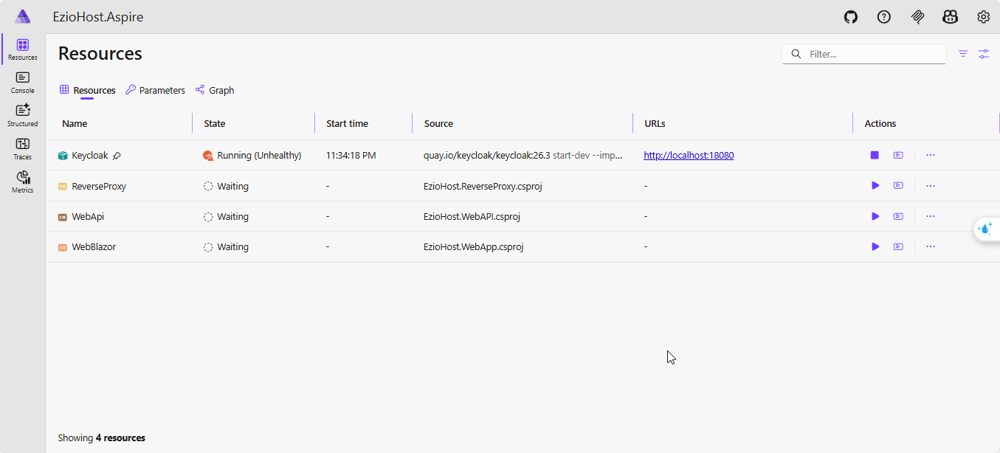
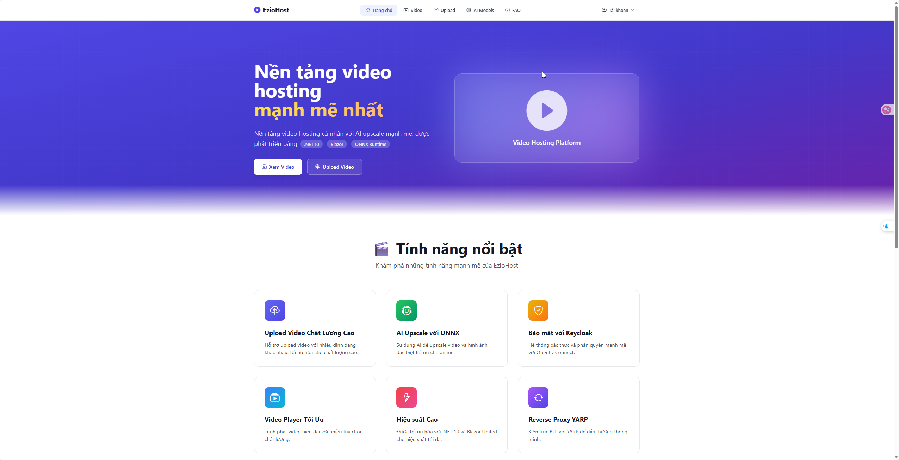
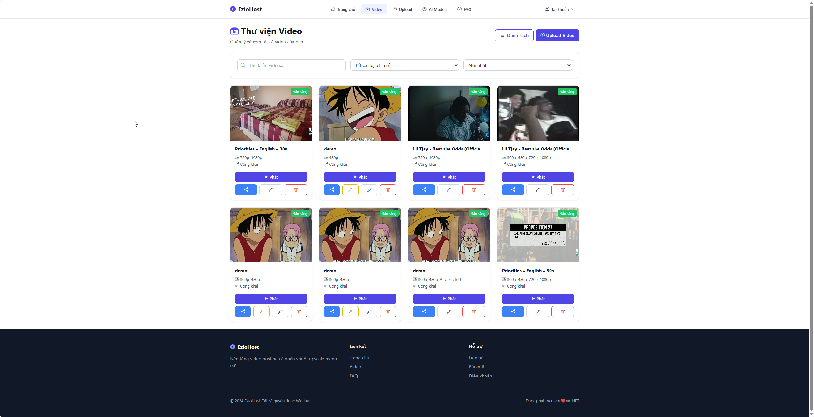
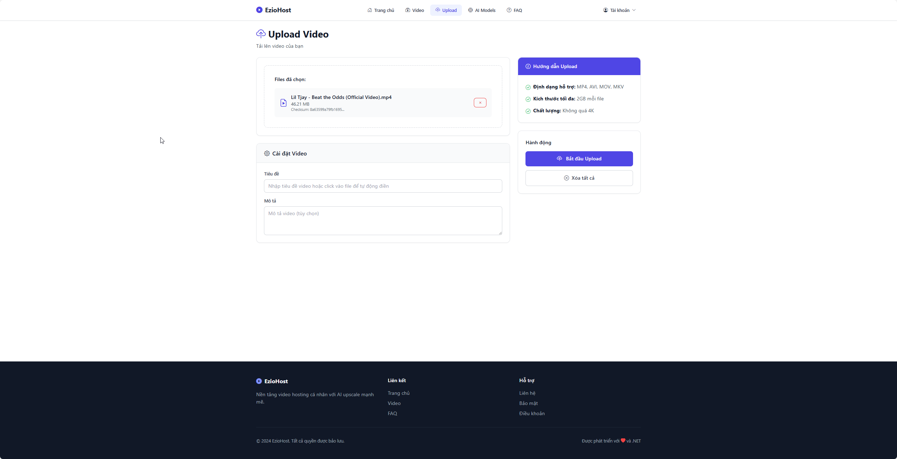
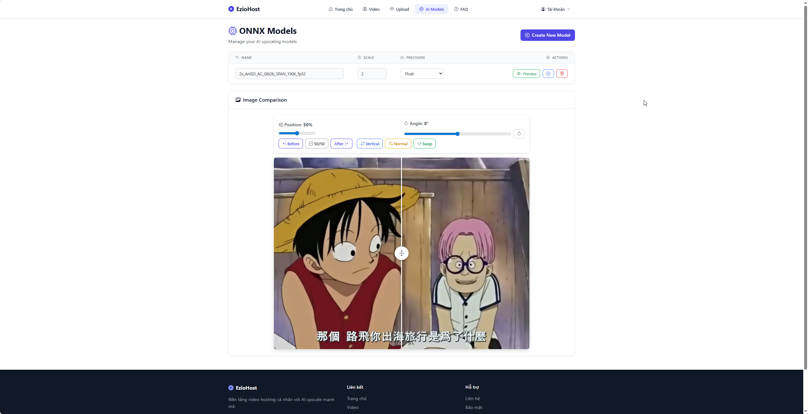
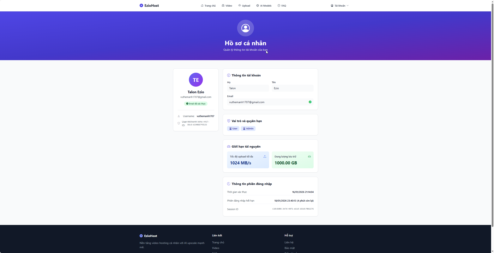
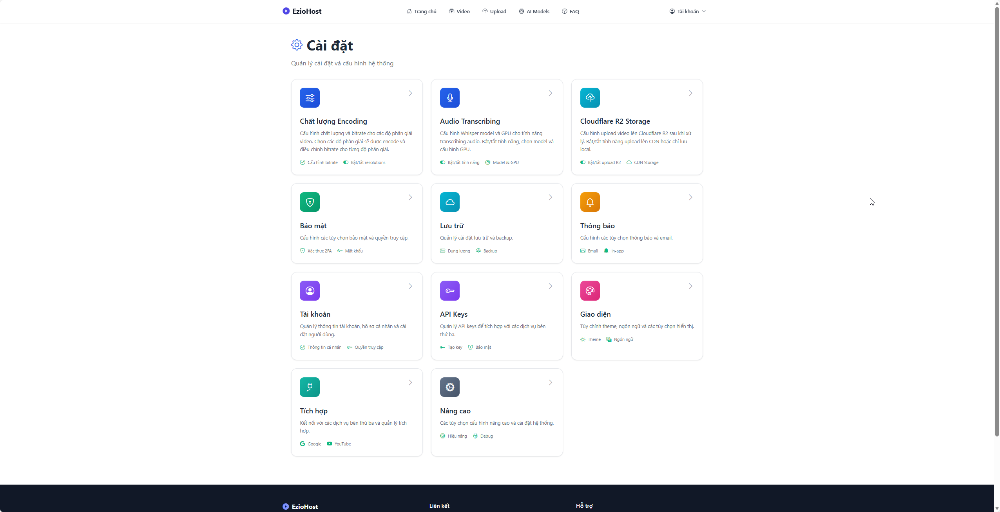
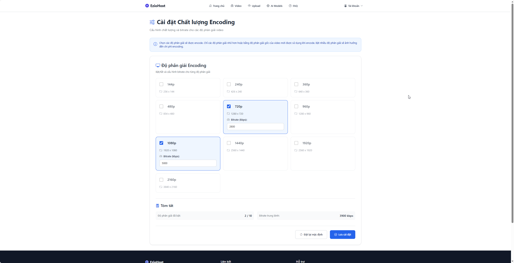
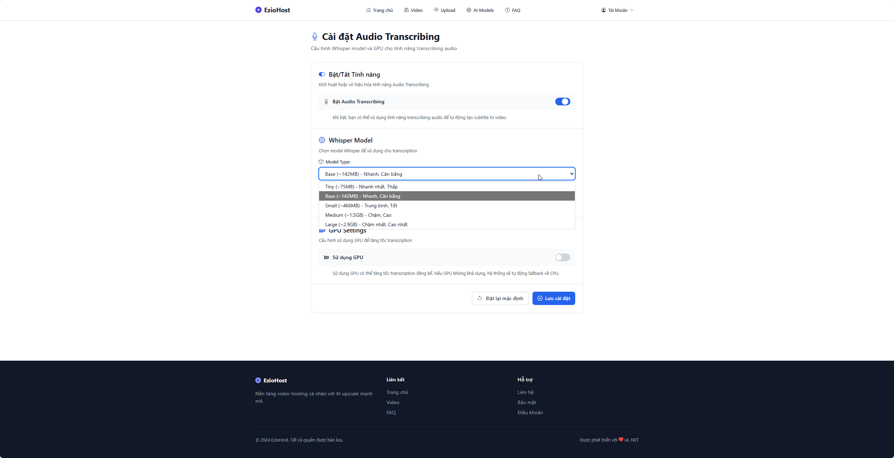
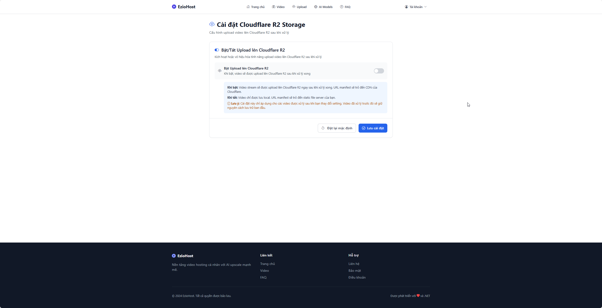

# XÂY DỰNG NỀN TẢNG STREAMING VIDEO TÍCH HỢP AI UPSCALING

## Giới thiệu

**EzioHost** là một nền tảng video hosting đầy đủ tính năng, hỗ trợ tải lên video, mã hóa HLS, bảo vệ DRM và nâng cấp chất lượng video bằng AI. Hệ thống được xây dựng với kiến trúc hiện đại, hỗ trợ xử lý video real-time và tích hợp các công nghệ AI tiên tiến.

### Công nghệ sử dụng (Tech Stack)

#### Backend
- **ASP.NET Core WebAPI** - Framework xây dựng RESTful API
- **Entity Framework Core** - ORM cho SQL Server
- **SignalR** - Real-time communication
- **Quartz.NET** - Background job scheduling
- **.NET Aspire** - Cloud-native orchestration

#### Frontend
- **Blazor WebAssembly** - Single Page Application framework
- **Blazor Server** - Server-side rendering (hybrid mode)

#### Infrastructure & Services
- **YARP (Yet Another Reverse Proxy)** - Reverse proxy và load balancing
- **Keycloak** - Identity and Access Management (OIDC/OAuth2)
- **SQL Server** - Database chính
- **Cloudflare R2** - Object storage (S3-compatible)

#### Media Processing
- **FFmpeg** - Video encoding/decoding, HLS streaming
- **ONNX Runtime** - AI model inference engine
- **OpenCV** - Image/video processing
- **Whisper AI** - Speech-to-text transcription

#### Development & Testing
- **BenchmarkDotNet** - Performance benchmarking
- **.NET SDK 10.0+** - Development framework

---

## Hướng dẫn cài đặt

Hướng dẫn này sẽ giúp bạn cài đặt và chạy dự án từ máy trắng (clean install).

### Bước 1: Cài đặt các công cụ cần thiết

#### 1.1. Cài đặt .NET SDK

Tải và cài đặt .NET SDK 10.0 hoặc cao hơn từ [dotnet.microsoft.com](https://dotnet.microsoft.com/download).

Kiểm tra cài đặt:
```powershell
dotnet --version
```

#### 1.2. Cài đặt SQL Server

Cài đặt SQL Server Developer Edition hoặc Express Edition:
- Tải từ [Microsoft SQL Server Downloads](https://www.microsoft.com/sql-server/sql-server-downloads)
- Hoặc sử dụng SQL Server trong Docker container

Kiểm tra SQL Server đã chạy:
```powershell
sqlcmd -S localhost -E -Q "SELECT @@VERSION"
```

#### 1.3. Cài đặt FFmpeg

1. Tải FFmpeg từ [ffmpeg.org](https://ffmpeg.org/download.html) hoặc sử dụng package manager:
   ```powershell
   # Sử dụng Chocolatey (nếu đã cài)
   choco install ffmpeg
   
   # Hoặc tải thủ công và giải nén
   ```

2. Thêm FFmpeg vào PATH:
   - Copy đường dẫn đến thư mục `bin` của FFmpeg (ví dụ: `C:\ffmpeg\bin`)
   - Thêm vào biến môi trường PATH trong Windows

3. Kiểm tra cài đặt:
   ```powershell
   ffmpeg -version
   ```

#### 1.4. Cài đặt Visual Studio (khuyến nghị)

Tải và cài đặt Visual Studio 2022 hoặc cao hơn với các workload:
- ASP.NET and web development
- .NET desktop development

Hoặc sử dụng Visual Studio Code với các extension:
- C# Dev Kit
- .NET Extension Pack

### Bước 2: Clone repository

```powershell
git clone <repository-url>
cd EzioHost
```

### Bước 3: Khởi tạo cơ sở dữ liệu

1. Tạo database mới trong SQL Server:
   ```sql
   CREATE DATABASE EzioHostDb;
   ```

2. Chạy script khởi tạo database:
   ```powershell
   sqlcmd -S localhost -d EzioHostDb -E -i .\Resources\db.sql
   ```
   
   Hoặc sử dụng SQL Server Management Studio (SSMS) để chạy script `Resources\db.sql`.

### Bước 4: Cấu hình kết nối database

Cập nhật chuỗi kết nối trong `Back-end\EzioHost.WebAPI\appsettings.Development.json`:

```json
{
  "ConnectionStrings": {
    "EzioHostDb": "Server=localhost;Database=EzioHostDb;Trusted_Connection=True;TrustServerCertificate=True;"
  }
}
```

**Lưu ý**: Nếu project đã được cấu hình sẵn kết nối tới database server, bạn có thể bỏ qua bước này.

### Bước 5: Cấu hình OIDC (Keycloak)

Cập nhật cấu hình OIDC trong `Back-end\EzioHost.WebAPI\appsettings.json`:

```json
{
  "AppSettings": {
    "JwtOidc": {
      "MetaDataAddress": "https://keycloak.talonezio.click/realms/EzioHost/.well-known/openid-configuration",
      "Issuer": "https://keycloak.talonezio.click/realms/EzioHost",
      "Audience": "Ezio-Host-Client"
    }
  }
}
```

**Thông tin đăng nhập Keycloak (môi trường thử nghiệm)**:
- URL: `https://keycloak.talonezio.click`
- Realm: `EzioHost`
- Client: `Ezio-Host-Client`
- Username: `admin`
- Password: `admin`

**Lưu ý**: Nếu project đã được cấu hình sẵn OIDC, bạn có thể bỏ qua bước này.

### Bước 6: Khôi phục và build solution

```powershell
# Khôi phục các package NuGet
dotnet restore EzioHost.sln

# Build solution
dotnet build EzioHost.sln -c Debug
```

### Bước 7: Cấu hình sharedsettings.json

Cập nhật file `Utility\EzioHost.Shared\sharedsettings.json` với các URL phù hợp:

```json
{
  "ReverseProxyUrl": "https://localhost:7210",
  "WebApiUrl": "https://localhost:7289",
  "FrontendUrl": "https://localhost:7164",
  "WebApiPrefixStaticFile": "static"
}
```

### Bước 8: Chạy ứng dụng

#### Phương án 1: Chạy bằng .NET Aspire (Khuyến nghị)

1. Mở solution trong Visual Studio
2. Chọn dự án khởi động: `Manager\EzioHost.Aspire\EzioHost.Aspire.AppHost`
3. Nhấn F5 hoặc Run để Aspire tự động orchestrate các thành phần

Hoặc chạy bằng dòng lệnh:
```powershell
cd .\Manager\EzioHost.Aspire\EzioHost.Aspire.AppHost
dotnet run
```

#### Phương án 2: Chạy nhiều project đồng thời (Visual Studio)

1. Nhấp phải vào Solution → **Set Startup Projects...**
2. Chọn **Multiple startup projects**
3. Đặt Action = **Start** cho các dự án sau (theo thứ tự):
   - `Back-end\EzioHost.WebAPI`
   - `Front-end\EzioHost.WebApp` (hoặc `EzioHost.WebApp.Client`)
   - `ReverseProxy\EzioHost.ReverseProxy`
4. Apply → OK → F5

#### Phương án 3: Chạy từng project riêng lẻ

Mở nhiều terminal và chạy lần lượt:

```powershell
# Terminal 1: WebAPI
cd .\Back-end\EzioHost.WebAPI
dotnet run

# Terminal 2: WebApp
cd .\Front-end\EzioHost.WebApp\EzioHost.WebApp
dotnet run

# Terminal 3: ReverseProxy
cd .\ReverseProxy\EzioHost.ReverseProxy
dotnet run
```

### Bước 9: Truy cập ứng dụng

Sau khi các service đã khởi động, truy cập ứng dụng qua:
- **Reverse Proxy**: `https://localhost:7210` (hoặc cổng đã cấu hình)
- **WebAPI trực tiếp**: `https://localhost:7289`
- **Frontend trực tiếp**: `https://localhost:7164`

### Lưu ý bổ sung

#### Cấu hình Video Codec (GPU/CPU)

Nếu máy có GPU, cấu hình encoder phần cứng trong `Back-end\EzioHost.WebAPI\appsettings.json`:

- **NVIDIA**: `h264_nvenc`
- **Intel (Quick Sync)**: `h264_qsv`
- **AMD**: `h264_amf`
- **CPU (mặc định)**: `libx264`

Kiểm tra encoder khả dụng:
```powershell
ffmpeg -encoders | findstr /I "nvenc qsv amf libx264"
```

#### Kiểm tra các yêu cầu

Trước khi chạy, đảm bảo:
- ✅ .NET SDK đã cài đặt và hoạt động
- ✅ SQL Server đã chạy và có thể kết nối
- ✅ FFmpeg đã cài đặt và có trong PATH
- ✅ Database đã được khởi tạo
- ✅ Các file `appsettings.json` đã được cấu hình đúng

---

## Demo Screenshots

Dưới đây là các ảnh chụp màn hình của hệ thống EzioHost:

### 1. Aspire Dashboard
Giao diện quản lý và giám sát các service thông qua .NET Aspire.



### 2. Trang chủ (Home)
Trang chủ hiển thị tổng quan về hệ thống và các video mới nhất.



### 3. Trang Video
Giao diện quản lý và xem video, hỗ trợ phát video với HLS streaming.



### 4. Trang Upload
Giao diện tải lên video với hỗ trợ drag & drop và xem tiến trình upload.



### 5. Trang Quản lý AI Model
Quản lý các mô hình AI dùng để nâng cấp chất lượng video/ảnh.



### 6. Trang Profile
Thông tin tài khoản người dùng và cài đặt cá nhân.



### 7. Trang Cài đặt (Settings)
Cấu hình tổng quan của hệ thống.



### 8. Cài đặt Encoding Video
Cấu hình các tham số mã hóa video (codec, bitrate, resolution, v.v.).



### 9. Cài đặt Encoding Audio
Cấu hình các tham số mã hóa audio (codec, bitrate, sample rate, v.v.).



### 10. Cài đặt Storage
Cấu hình lưu trữ (Cloudflare R2, local storage, v.v.).



---

## Demo Output

Bạn có thể thử nghiệm các file mẫu/tài nguyên có sẵn trong thư mục `Resources`:

- **frame.jpg**: Ảnh khung hình gốc dùng thử xử lý/nâng cấp.<br>
  

- **frame_upscaled.jpg**: Ảnh khung hình đã được nâng cấp bằng AI (tham khảo kết quả).<br>
  

- **frame_compare.png**: Ảnh so sánh trước/sau nâng cấp để quan sát chất lượng.<br>
  

- **demo_480p.mp4**: Video mẫu 480p để upload, mã hóa HLS và nâng cấp bằng AI.  
  https://raw.githubusercontent.com/TalonEzio/EzioHost/refs/heads/master/Resources/demo_480p.mp4

- **demo_480p_upscaled.mp4**: Video mẫu đã được nâng cấp từ 480p (tham khảo kết quả).  
  https://raw.githubusercontent.com/TalonEzio/EzioHost/refs/heads/master/Resources/demo_480p_upscaled.mp4

> **Lưu ý**: Các file này chỉ nên dùng cho mục đích kiểm thử. Có thể dùng chúng để upload thử nghiệm qua giao diện web hoặc các API liên quan.

---

## Tài liệu bổ sung

### Chạy Benchmark hiệu năng (tuỳ chọn)

Project benchmark nằm tại: `Test\EzioHost.Benchmark` (TargetFramework `net9.0`, dùng BenchmarkDotNet).

Chạy nhanh:
```powershell
cd .\Test\EzioHost.Benchmark
dotnet run -c Release

# hoặc từ root solution
dotnet run -c Release --project .\Test\EzioHost.Benchmark\EzioHost.Benchmark.csproj
```

Lưu ý:
- Chạy ở cấu hình Release để có kết quả chính xác.
- Lần chạy đầu có thể lâu vì BenchmarkDotNet thực hiện warmup và nhiều iteration.
- Nếu máy có GPU NVIDIA và đã cài CUDA phù hợp, OnnxRuntime GPU có thể được sử dụng để đo hiệu năng tăng tốc; nếu không, sẽ rơi về CPU.

### Tải và sử dụng model AI từ OpenModelDB

Trang mẫu model upscale: `https://openmodeldb.info/`

Hướng dẫn nhanh:
1. Truy cập trang trên và tìm model phù hợp (theo thể loại, tốc độ, chất lượng, v.v.).
2. Tải model (thường là định dạng ONNX) về máy.
3. Thêm model vào hệ thống:
   - Qua giao diện Upload Model trong ứng dụng: chọn file `.onnx`, nhập đúng thông tin.
   - Hoặc copy vào vị trí mà backend có thể truy cập rồi đăng ký trong phần quản trị (nếu có).
4. Chọn model khi thực hiện nâng cấp video/ảnh.

Lưu ý quan trọng về Scale:
- Mỗi model có hệ số phóng đại (Scale) cố định như 1x/2x/4x.
- Khi upload model mới vào hệ thống, hãy nhập đúng `Scale` theo mô tả trên trang model. Scale sai có thể gây méo hình, sai tỷ lệ hoặc giảm chất lượng.
- Nếu model là 1x (không phóng), hệ thống vẫn có thể dùng để khử nhiễu/phục hồi chi tiết mà không thay đổi độ phân giải.

Tham khảo thêm hướng dẫn từ trang FAQ của OpenModelDB:
- Định dạng model hỗ trợ: `.onnx` (ONNX), `.pth` (PyTorch), `.bin/.param` (NCNN).
- Khái niệm Upscaling (SISR/VSR) và dataset huấn luyện được giải thích rõ.
- Các chương trình được khuyến nghị để chạy model:
  - `chaiNNer` (open-source, hỗ trợ PyTorch/ONNX/NCNN),
  - `AnimeJaNaiConverterGui` (ONNX, hỗ trợ TensorRT/DirectML/NCNN),
  - `enhancr`, `VSGAN-TensorRT-docker`, `Upscayl`, v.v.

Tài liệu: [OpenModelDB FAQ](https://openmodeldb.info/docs/faq)

---

Ghi chú: Phần hướng dẫn này sẽ tiếp tục được cập nhật bổ sung.
