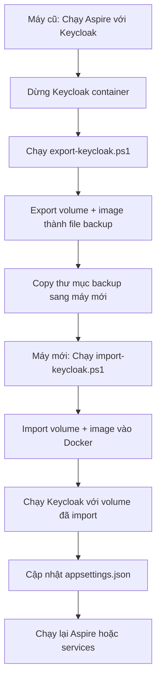

# Hướng Dẫn Export/Import Keycloak Docker Container và Volume

Tài liệu này hướng dẫn cách export Keycloak container và data volume (chứa realm đã cấu hình) từ máy này sang máy khác, giúp bạn tránh phải setup lại realm từ đầu.

## Tổng Quan

Keycloak được chạy qua Aspire với persistent data volume. Volume này chứa toàn bộ cấu hình realm `EzioHost`, clients, users, và các settings. Bằng cách export/import volume này, bạn có thể chuyển toàn bộ cấu hình sang máy mới mà không cần setup lại.

## Yêu Cầu

- Docker Desktop đã cài đặt và đang chạy
- PowerShell (Windows) hoặc có thể chạy trên Linux/Mac với điều chỉnh nhỏ
- Keycloak container đã được chạy ít nhất một lần qua Aspire

## Export Keycloak (Máy Cũ)

### Bước 1: Dừng Keycloak Container (Khuyến nghị)

Trước khi export, nên dừng Keycloak container để đảm bảo data consistency:

```powershell
# Tìm và dừng Keycloak container
docker ps | findstr -i keycloak
docker stop <container-name>
```

Hoặc dừng toàn bộ Aspire application.

### Bước 2: Chạy Export Script

Từ thư mục root của project:

```powershell
.\scripts\export-keycloak.ps1
```

Hoặc với các tùy chọn:

```powershell
# Tự động dừng container trước khi export
.\scripts\export-keycloak.ps1 -StopContainer

# Chỉ định thư mục output khác
.\scripts\export-keycloak.ps1 -OutputPath "my-keycloak-backup"
```

### Bước 3: Kiểm Tra Kết Quả

Script sẽ tạo thư mục backup (mặc định: `keycloak-backup`) chứa:

- `keycloak-data-backup.tar.gz` - Backup của data volume (quan trọng nhất)
- `keycloak-image.tar` - Backup của Docker image (nếu có custom image)
- `keycloak-export-info.txt` - Thông tin về export

### Bước 4: Copy Sang Máy Mới

Copy toàn bộ thư mục backup sang máy mới (qua USB, network share, cloud storage, v.v.)

## Import Keycloak (Máy Mới)

### Bước 1: Copy Backup Sang Máy Mới

Đảm bảo thư mục backup đã được copy vào project root hoặc biết đường dẫn đầy đủ.

### Bước 2: Chạy Import Script

Từ thư mục root của project:

```powershell
.\scripts\import-keycloak.ps1
```

Hoặc với các tùy chọn:

```powershell
# Chỉ định đường dẫn backup
.\scripts\import-keycloak.ps1 -BackupPath "keycloak-backup"

# Chỉ định tên volume mới
.\scripts\import-keycloak.ps1 -VolumeName "my-keycloak-data"

# Chỉ định port khác
.\scripts\import-keycloak.ps1 -Port 18081

# Tự động start container sau khi import
.\scripts\import-keycloak.ps1 -StartContainer
```

### Bước 3: Chạy Keycloak

Sau khi import, bạn có 3 cách để chạy Keycloak:

#### Cách 1: Dùng Script Tự Động (Khuyến nghị)

Script import sẽ tạo file `run-keycloak.ps1` trong thư mục backup:

```powershell
.\keycloak-backup\run-keycloak.ps1
```

#### Cách 2: Chạy Docker Command Trực Tiếp

```powershell
docker run -d `
    --name keycloak-restored `
    -p 18080:8080 `
    -e KEYCLOAK_ADMIN=admin `
    -e KEYCLOAK_ADMIN_PASSWORD=admin `
    -v keycloak-data-restored:/opt/keycloak/data `
    quay.io/keycloak/keycloak:latest `
    start-dev
```

#### Cách 3: Dùng Aspire

Nếu muốn dùng Aspire, bạn cần đảm bảo volume name khớp với tên Aspire sử dụng. Thường là format: `aspire-<project-name>-Keycloak-data`.

Có thể chỉnh sửa `Manager/EzioHost.Aspire/EzioHost.Aspire.AppHost/Program.cs` để sử dụng volume đã import, hoặc đổi tên volume cho khớp.

### Bước 4: Kiểm Tra Keycloak

1. Mở browser và truy cập: `http://localhost:18080`
2. Đăng nhập admin console: `http://localhost:18080/admin`
   - Username: `admin`
   - Password: `admin` (hoặc password bạn đã set)
3. Kiểm tra realm `EzioHost` đã có sẵn với tất cả cấu hình

### Bước 5: Cập Nhật Cấu Hình Ứng Dụng

Đảm bảo các file `appsettings.json` trỏ đúng URL Keycloak mới:

**ReverseProxy/appsettings.json:**
```json
{
  "AppSettings": {
    "OpenIdConnect": {
      "Authority": "http://localhost:18080/realms/EzioHost",
      ...
    }
  }
}
```

**WebAPI/appsettings.json:**
```json
{
  "AppSettings": {
    "JwtOidc": {
      "MetaDataAddress": "http://localhost:18080/realms/EzioHost/.well-known/openid-configuration",
      "Issuer": "http://localhost:18080/realms/EzioHost",
      ...
    }
  }
}
```

## Troubleshooting

### Lỗi: "No Keycloak volume found"

**Nguyên nhân:** Keycloak chưa được chạy qua Aspire, hoặc volume đã bị xóa.

**Giải pháp:**
1. Chạy Aspire ít nhất một lần để tạo volume
2. Kiểm tra volumes: `docker volume ls`
3. Nếu volume có tên khác, chỉnh sửa script để tìm đúng volume

### Lỗi: "Volume already exists" khi import

**Nguyên nhân:** Volume với tên đó đã tồn tại.

**Giải pháp:**
1. Dùng `-VolumeName` để chỉ định tên khác
2. Hoặc xóa volume cũ: `docker volume rm <volume-name>`
3. Hoặc cho phép script tự động xóa và tạo lại

### Lỗi: "Port already in use"

**Nguyên nhân:** Port 18080 đã được sử dụng bởi service khác.

**Giải pháp:**
1. Dùng `-Port` để chỉ định port khác
2. Hoặc dừng service đang dùng port đó
3. Kiểm tra: `netstat -ano | findstr :18080`

### Keycloak không khởi động được

**Nguyên nhân:** Có thể do:
- Volume data bị corrupt
- Permissions không đúng
- Image không tương thích

**Giải pháp:**
1. Kiểm tra logs: `docker logs keycloak-restored`
2. Thử pull image mới: `docker pull quay.io/keycloak/keycloak:latest`
3. Kiểm tra volume: `docker volume inspect <volume-name>`

### Realm không hiển thị sau khi import

**Nguyên nhân:** Data chưa được import đúng, hoặc Keycloak chưa load realm.

**Giải pháp:**
1. Kiểm tra volume có data: `docker run --rm -v <volume-name>:/data alpine ls -la /data`
2. Restart Keycloak container
3. Kiểm tra Keycloak logs để xem có lỗi gì không

## Lưu Ý Quan Trọng

1. **Backup thường xuyên:** Nên export volume định kỳ để có backup
2. **Dừng container trước export:** Để đảm bảo data consistency
3. **Kiểm tra port:** Đảm bảo port không bị conflict trên máy mới
4. **Cập nhật cấu hình:** Nhớ cập nhật `appsettings.json` sau khi import
5. **Version compatibility:** Đảm bảo Keycloak version tương thích giữa máy cũ và mới
6. **Network:** Nếu chạy trên network khác, cập nhật URL trong cấu hình

## Workflow Tóm Tắt



## Câu Hỏi Thường Gặp

**Q: Có cần export image không?**  
A: Thường không cần, vì Keycloak dùng base image từ Docker Hub. Chỉ cần export volume là đủ.

**Q: Có thể dùng volume name cũ không?**  
A: Có, nhưng nên dùng tên mới để tránh conflict. Aspire sẽ tự tạo volume mới nếu cần.

**Q: Export có ảnh hưởng đến Keycloak đang chạy không?**  
A: Nên dừng container trước khi export để đảm bảo data consistency. Nếu không dừng, có thể có risk nhỏ về data inconsistency.

**Q: Có thể import nhiều lần không?**  
A: Có, nhưng mỗi lần import sẽ ghi đè lên volume hiện tại. Nên backup volume hiện tại trước khi import mới.

**Q: Volume size thường là bao nhiêu?**  
A: Tùy thuộc vào số lượng users, clients, và cấu hình. Thường từ vài MB đến vài trăm MB.

## Tham Khảo

- [Docker Volume Documentation](https://docs.docker.com/storage/volumes/)
- [Keycloak Docker Image](https://quay.io/repository/keycloak/keycloak)
- [Aspire Documentation](https://learn.microsoft.com/dotnet/aspire/)
