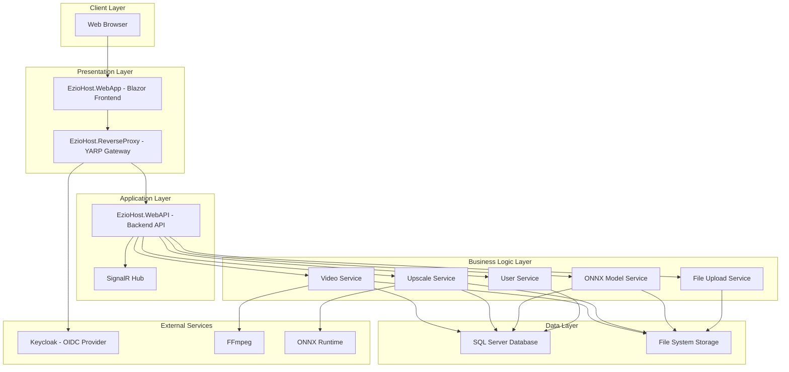

# Báo cáo tổng hợp dự án EzioHost

## 1. Lý do chọn đề tài và mục tiêu của dự án

### 1.1 Lý do chọn đề tài
EzioHost là một nền tảng video hosting cá nhân được phát triển làm đồ án tốt nghiệp. Đề tài này được chọn với các lý do chính sau:

- **Nhu cầu thực tế**: Sự phát triển mạnh mẽ của nội dung video trong thời đại số, đặc biệt là nhu cầu về các nền tảng hosting video cá nhân với tính năng nâng cao chất lượng bằng AI.
- **Tích hợp công nghệ hiện đại**: Kết hợp nhiều công nghệ tiên tiến như .NET 10, Blazor, ONNX Runtime, và AI upscaling để tạo ra một giải pháp toàn diện.
- **Thách thức kỹ thuật**: Xử lý video, mã hóa HLS, bảo vệ DRM và AI upscaling là những vấn đề kỹ thuật phức tạp, phù hợp cho một đồ án tốt nghiệp trình bày năng lực kỹ thuật.
- **Tính ứng dụng cao**: Có thể ứng dụng thực tế cho việc lưu trữ và chia sẻ video cá nhân hoặc doanh nghiệp nhỏ.

### 1.2 Mục tiêu của dự án
- Xây dựng một nền tảng video hosting hoàn chỉnh với khả năng upload, mã hóa, và phát video.
- Tích hợp công nghệ AI để nâng cấp chất lượng video (upscaling).
- Triển khai hệ thống bảo vệ nội dung video bằng DRM (Digital Rights Management).
- Cung cấp giao diện người dùng hiện đại và thân thiện với Blazor.
- Áp dụng kiến trúc microservices với các thành phần riêng biệt cho frontend, backend và reverse proxy.

## 2. Kiến trúc hệ thống tổng thể

### 2.1 Tổng quan kiến trúc
EzioHost được xây dựng theo kiến trúc microservices hiện đại với các thành phần chính:

### 2.2 Các thành phần chính
- **Frontend (Blazor Web App)**: Giao diện người dùng được xây dựng bằng Blazor United, cung cấp trải nghiệm tương tác và hiện đại.
- **Reverse Proxy (YARP)**: Cổng vào (gateway) của hệ thống, điều hướng yêu cầu đến các dịch vụ phù hợp và xử lý xác thực.
- **Backend API (ASP.NET Core Web API)**: Cung cấp các API RESTful cho xử lý video, upscaling, quản lý người dùng, v.v.
- **Database (SQL Server)**: Lưu trữ thông tin về video, người dùng, model AI, v.v.
- **File Storage**: Lưu trữ các file video đã upload, video đã mã hóa, và các file liên quan.
- **Background Jobs (Quartz.NET)**: Xử lý các tác vụ nền như mã hóa video và upscaling.
- **SignalR Hub**: Cung cấp kết nối real-time giữa server và client.

## 3. Phân tích các thành phần backend và chức năng chính

### 3.1 Cấu trúc Backend
Backend được xây dựng theo kiến trúc Clean Architecture với các lớp:

- **Domain Layer**: Chứa các entities, enums, và logic nghiệp vụ cốt lõi.
- **Core Layer**: Chứa các interfaces, services, và repositories.
- **Infrastructure Layer**: Chứa các triển khai cụ thể cho repositories và các dịch vụ cơ sở hạ tầng.
- **WebAPI Layer**: Lớp trình bày, chứa các controllers và API endpoints.

### 3.2 Các chức năng chính

#### 3.2.1 Quản lý Video
- **Upload Video**: Hỗ trợ upload file video với chunked upload để xử lý các file lớn.
- **Mã hóa Video**: Sử dụng FFmpeg để mã hóa video sang định dạng HLS với nhiều độ phân giải khác nhau.
- **Phát Video**: Cung cấp endpoint để phát video qua HLS với các chất lượng khác nhau.
- **Quản lý Metadata**: Lưu trữ và quản lý thông tin về video như tiêu đề, mô tả, thumbnail, v.v.

#### 3.2.2 AI Upscaling
- **Model Management**: Quản lý các model ONNX用于 upscaling video và hình ảnh.
- **Video Upscaling**: Sử dụng AI model để nâng cao chất lượng video, tăng độ phân giải.
- **Frame Extraction**: Trích xuất các khung hình từ video để xử lý bằng AI.
- **Frame Reconstruction**: Tái tạo video từ các khung hình đã được upscale.

#### 3.2.3 Bảo vệ nội dung (DRM)
- **Key Generation**: Tạo khóa mã hóa và IV cho mỗi video stream.
- **HLS Encryption**: Mã hóa các segment video theo chuẩn HLS.
- **Key Distribution**: Cung cấp khóa giải mã cho client có quyền truy cập.

#### 3.2.4 Quản lý người dùng
- **Xác thực**: Tích hợp với Keycloak để xác thực người dùng qua OpenID Connect.
- **Phân quyền**: Quản lý vai trò và quyền truy cập của người dùng.
- **Profile Management**: Quản lý thông tin cá nhân của người dùng.

## 4. Phân tích các thành phần frontend và giao diện người dùng

### 4.1 Cấu trúc Frontend
Frontend được xây dựng bằng Blazor United với các thành phần chính:

- **Pages**: Các trang chính như HomePage, AuthPage, ErrorPage, FAQPage.
- **Components**: Các thành phần UI tái sử dụng.
- **Services**: Các dịch vụ để tương tác với backend API.
- **Handlers**: Xử lý xác thực và các tác vụ liên quan.

### 4.2 Giao diện người dùng
- **Trang chủ**: Giới thiệu về nền tảng và các tính năng chính.
- **Trang quản lý video**: Cho phép người dùng upload, xem, và quản lý video của mình.
- **Trang upscaling**: Cung cấp giao diện để upscale video và hình ảnh bằng AI.
- **Trang xác thực**: Đăng nhập và đăng ký người dùng.

### 4.3 Tương tác với Backend
Frontend sử dụng Refit để tạo các client HTTP mạnh mẽ để tương tác với backend API. Các yêu cầu được định tuyến qua Reverse Proxy để đảm bảo tính nhất quán và bảo mật.

## 5. Công nghệ và framework sử dụng

### 5.1 Backend Technologies
- **.NET 10**: Framework phát triển chính, phiên bản mới nhất từ Microsoft.
- **ASP.NET Core**: Framework để xây dựng Web API và các dịch vụ backend.
- **Entity Framework Core**: ORM để tương tác với cơ sở dữ liệu SQL Server.
- **SignalR**: Thư viện để cung cấp kết nối real-time giữa server và client.
- **Quartz.NET**: Thư viện để lập lịch và thực hiện các tác vụ nền.
- **FFMpegCore**: Thư viện để tương tác với FFmpeg cho xử lý video.
- **ONNX Runtime**: Runtime để thực thi các model AI cho upscaling.
- **OpenCV**: Thư viện xử lý hình ảnh cho AI upscaling.

### 5.2 Frontend Technologies
- **Blazor United**: Framework frontend của Microsoft cho phép phát triển web với C#.
- **Bootstrap**: Framework CSS để thiết kế giao diện responsive.
- **Refit**: Thư viện để tạo các client HTTP mạnh mẽ.
- **Player.js**: Thư viện để phát video HLS trong trình duyệt.

### 5.3 Infrastructure Technologies
- **YARP (Yet Another Reverse Proxy)**: Reverse proxy của Microsoft để điều hướng yêu cầu.
- **Keycloak**: Server xác thực và phân quyền mã nguồn mở.
- **SQL Server**: Hệ quản trị cơ sở dữ liệu.
- **Docker**: Containerization (nếu có).

## 6. Quy trình xử lý video và AI upscale

### 6.1 Quy trình xử lý video
1. **Upload Video**: Người dùng upload video qua frontend, file được chia thành các chunks và gửi lên server.
2. **Lưu trữ Video**: File video được lưu trữ trên file system và thông tin được lưu vào database.
3. **Mã hóa Video**: Một job nền được tạo để mã hóa video sang định dạng HLS với nhiều độ phân giải.
4. **Tạo Thumbnail**: Tạo hình ảnh đại diện cho video.
5. **Tạo Playlist**: Tạo file playlist M3U8 chính chứa các stream với độ phân giải khác nhau.
6. **Bảo vệ nội dung**: Mã hóa các segment video và tạo khóa giải mã.
7. **Hoàn thành**: Cập nhật trạng thái video thành "Ready" và thông báo cho người dùng qua SignalR.

### 6.2 Quy trình AI Upscaling
1. **Chọn Model**: Người dùng chọn model AI để upscale video.
2. **Trích xuất Frame**: Video được trích xuất thành các frame hình ảnh riêng lẻ.
3. **Xử lý Frame**: Mỗi frame được xử lý qua AI model để tăng chất lượng và độ phân giải.
4. **Tái tạo Video**: Các frame đã được upscale được kết hợp lại thành video mới.
5. **Mã hóa Video**: Video mới được mã hóa sang định dạng HLS.
6. **Cập nhật Playlist**: Playlist chính được cập nhật để bao gồm stream đã upscale.
7. **Hoàn thành**: Cập nhật trạng thái và thông báo cho người dùng.

## 7. Hệ thống bảo mật và xác thực

### 7.1 Xác thực người dùng
- **OpenID Connect**: Sử dụng Keycloak làm nhà cung cấp nhận dạng (Identity Provider).
- **JWT Token**: Sử dụng JWT token để xác thực các yêu cầu API.
- **Cookie-based Authentication**: Sử dụng cookie cho phiên làm việc của người dùng trên web.

### 7.2 Phân quyền
- **Role-based Access Control**: Phân quyền dựa trên vai trò (Admin, User, VipUser).
- **Resource-based Authorization**: Kiểm soát truy cập dựa trên quyền sở hữu tài nguyên.

### 7.3 Bảo vệ nội dung video
- **HLS Encryption**: Mã hóa các segment video theo chuẩn HLS.
- **Key Management**: Quản lý việc tạo và phân phối khóa giải mã.
- **Access Control**: Kiểm soát truy cập dựa trên trạng thái đăng nhập và quyền sở hữu video.

## 8. Cách xây dựng và triển khai dự án

### 8.1 Cấu trúc Solution
Dự án được tổ chức theo cấu trúc solution với các project riêng biệt cho từng thành phần:

- **Front-end**: Chứa các project Blazor WebApp và Components.
- **Back-end**: Chứa các project Domain, Core, Infrastructure, và WebAPI.
- **Manager**: Chứa các project liên quan đến Aspire cho orchestration.
- **ReverseProxy**: Chứa project YARP Reverse Proxy.
- **Utility**: Chứa các project chia sẻ như Shared models và constants.
- **Test**: Chứa các project testing và benchmark.

### 8.2 Quy trình phát triển
1. **Thiết kế Database**: Thiết kế schema cho các entities và relationships.
2. **Phát triển Backend**: Xây dựng các services, repositories, và API endpoints.
3. **Phát triển Frontend**: Xây dựng giao diện người dùng với Blazor.
4. **Tích hợp**: Kết nối frontend và backend thông qua API.
5. **Testing**: Thực hiện unit tests, integration tests, và benchmark.
6. **Triển khai**: Sử dụng Aspire để orchestrate các dịch vụ trong môi trường development/production.

### 8.3 Triển khai
- **Development**: Chạy các dịch vụ riêng biệt hoặc sử dụng Aspire AppHost để orchestrate.
- **Production**: Triển khai các dịch vụ lên container hoặc server riêng biệt.
- **Configuration**: Sử dụng appsettings.json cho cấu hình môi trường.
- **Database Migration**: Sử dụng EF Core Migrations hoặc script SQL để khởi tạo database.

## 9. Điểm nổi bật và tiềm năng phát triển

### 9.1 Điểm nổi bật
- **Kiến trúc hiện đại**: Áp dụng kiến trúc Clean Architecture và microservices.
- **Công nghệ tiên tiến**: Sử dụng .NET 10, Blazor United, và ONNX Runtime.
- **AI Integration**: Tích hợp AI để nâng cao chất lượng video.
- **Bảo mật cao**: Triển khai DRM và hệ thống xác thực mạnh mẽ.
- **Real-time Communication**: Sử dụng SignalR để cung cấp thông báo real-time.

### 9.2 Tiềm năng phát triển
- **Mobile App**: Phát triển ứng dụng di động để truy cập nền tảng.
- **Cloud Integration**: Tích hợp với các dịch vụ cloud như Azure Blob Storage.
- **Advanced AI Models**: Hỗ trợ nhiều model AI hơn cho các tác vụ khác nhau.
- **Analytics**: Thêm hệ thống phân tích để theo dõi hành vi người dùng.
- **Monetization**: Thêm các tính năng thanh toán và subscription.

## 10. Kết luận

EzioHost là một dự án đồ án tốt nghiệp ấn tượng, thể hiện sự am hiểu sâu sắc về các công nghệ hiện đại và khả năng áp dụng chúng vào giải quyết các vấn đề thực tế. Dự án không chỉ cung cấp một nền tảng video hosting hoàn chỉnh mà còn tích hợp các công nghệ tiên tiến như AI upscaling và DRM, cho thấy tầm nhìn xa và năng lực kỹ thuật cao của người phát triển.

Với kiến trúc module hóa, công nghệ hiện đại, và các tính năng hữu ích, EzioHost có tiềm năng phát triển thành một sản phẩm thực tế có thể ứng dụng trong nhiều lĩnh vực khác nhau.